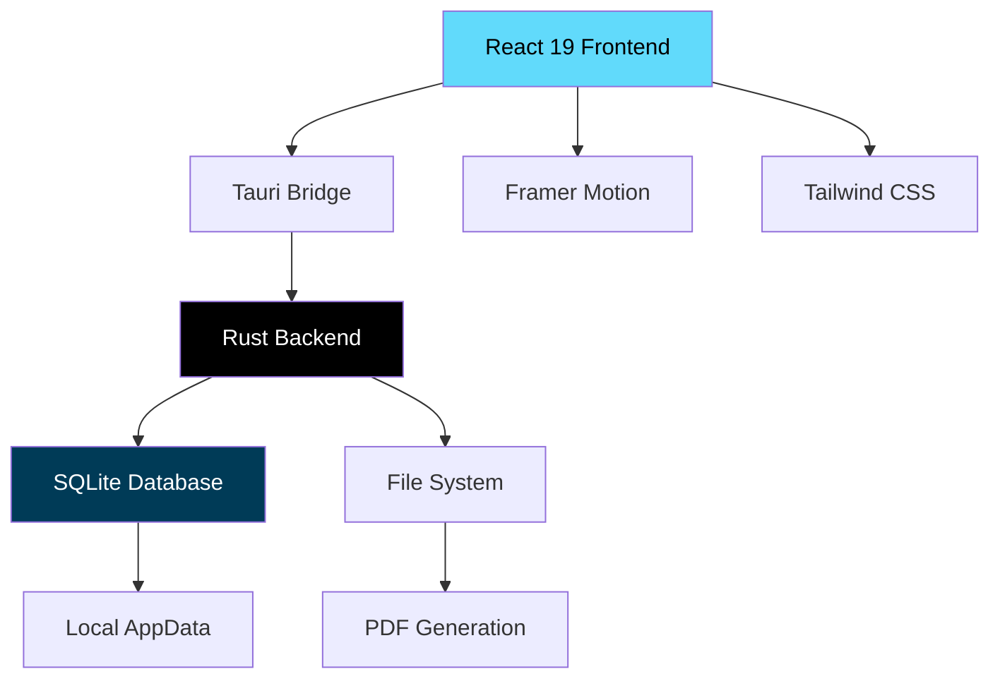

[English](./README.md) | [Español](./README.es.md) | [Português](./README.pt.md)

# Invoice Zero

Privacy-focused local-first invoice automation built with Tauri and React.

<!-- CTAs -->
<p align="center">
  <a href="https://github.com/LuisSambrano/invoice-automation-saas/stargazers"></a>
  <a href="https://github.com/LuisSambrano/invoice-automation-saas/network/members"></a>
  <a href="https://github.com/LuisSambrano/invoice-automation-saas/issues"></a>
  <a href="https://github.com/LuisSambrano/invoice-automation-saas/blob/main/LICENSE"></a>
</p>

## Overview

Invoice Zero is a desktop application for creating and managing invoices without relying on cloud services or subscriptions. The application stores all data locally on your device using SQLite, ensuring complete privacy and offline functionality.

Built with Tauri v2, the application combines a Rust backend for performance and security with a React frontend for a modern user interface. The local-first architecture means your financial data never leaves your device, and the application works without an internet connection.

The interface implements a glassmorphism design system with smooth animations powered by Framer Motion, providing a professional aesthetic while maintaining fast performance across all platforms.

## Architecture



## Features

### Local-First Architecture

- **Complete Privacy**: All data stored locally in SQLite
- **Offline Functionality**: Works without internet connection
- **No Subscriptions**: One-time purchase, no recurring fees
- **Zero Telemetry**: No tracking or data collection

### Invoice Management

- **Create Invoices**: Professional invoice templates
- **Client Database**: Store client information locally
- **PDF Export**: Generate PDF invoices for distribution
- **Invoice History**: Track all invoices with search and filtering

### Security

- **Memory Safe**: Rust backend prevents common vulnerabilities
- **Encrypted Storage**: Data encrypted at rest in SQLite
- **Native Performance**: Direct filesystem access without Node.js overhead
- **Cross-Platform**: macOS, Windows, and Linux support

### User Experience

- **Glassmorphism Design**: Modern translucent UI
- **Spring Animations**: Smooth Framer Motion physics
- **Responsive Layout**: Adapts to all window sizes
- **Type Safety**: End-to-end TypeScript from database to UI

## Tech Stack


**Backend**:

- [Tauri v2](https://tauri.app/) - Desktop application framework
- [Rust](https://www.rust-lang.org/) - System programming language
- [SQLite](https://www.sqlite.org/) - Embedded database via sqlx

**Frontend**:

- [React 19](https://react.dev/) - UI component library
- [TypeScript](https://www.typescriptlang.org/) - Type-safe development
- [Tailwind CSS](https://tailwindcss.com/) - Utility-first styling
- [Framer Motion](https://www.framer.com/motion/) - Animation library

## Getting Started

### Prerequisites

- **Rust**: Install from [rustup.rs](https://rustup.rs/)
- **Node.js**: Version 20 or higher
- **Platform-specific tools**:
  - macOS: Xcode Command Line Tools
  - Windows: Visual Studio Build Tools
  - Linux: Development packages (see Tauri docs)

### Installation

1. **Clone the repository**:

```bash
git clone https://github.com/LuisSambrano/invoice-zero.git
cd invoice-zero
```

2. **Install frontend dependencies**:

```bash
npm install
```

3. **Run in development mode**:

```bash
npm run tauri dev
```

The application will launch with hot reload enabled for both frontend and backend changes.

### Building for Production

**macOS (Universal Binary)**:

```bash
npm run tauri build -- --target universal-apple-darwin
```

**Windows (MSI Installer)**:

```bash
npm run tauri build
```

**Linux (AppImage/DEB)**:

```bash
npm run tauri build
```

Built applications will be in `src-tauri/target/release/bundle/`.

## Project Structure

```
invoice-zero/
├── src/                    # React frontend
│   ├── components/        # UI components
│   ├── services/          # Business logic
│   └── types/             # TypeScript definitions
├── src-tauri/             # Rust backend
│   ├── src/
│   │   ├── main.rs       # Application entry point
│   │   ├── commands.rs   # Tauri commands
│   │   └── database.rs   # SQLite operations
│   └── Cargo.toml        # Rust dependencies
└── package.json          # Frontend dependencies
```

## Database Schema

The application uses SQLite with the following core tables:

```sql
-- Clients table
CREATE TABLE clients (
  id INTEGER PRIMARY KEY,
  name TEXT NOT NULL,
  email TEXT,
  address TEXT,
  created_at DATETIME DEFAULT CURRENT_TIMESTAMP
);

-- Invoices table
CREATE TABLE invoices (
  id INTEGER PRIMARY KEY,
  client_id INTEGER,
  invoice_number TEXT UNIQUE,
  amount REAL,
  status TEXT,
  created_at DATETIME DEFAULT CURRENT_TIMESTAMP,
  FOREIGN KEY (client_id) REFERENCES clients(id)
);
```

## Privacy & Security

### Data Storage

All data is stored locally in your user's application data directory:

- **macOS**: `~/Library/Application Support/invoice-zero/`
- **Windows**: `%APPDATA%\invoice-zero\`
- **Linux**: `~/.local/share/invoice-zero/`

### Security Features

- **Memory Safety**: Rust's ownership system prevents buffer overflows and null pointer dereferences
- **Type Safety**: End-to-end type checking from SQL queries to React components
- **No Network Access**: Application does not make external network requests
- **Encrypted at Rest**: SQLite database encrypted using platform-native encryption

## Contributing

Contributions are welcome. Please follow these guidelines:

1. Fork the repository
2. Create a feature branch: `git checkout -b feature/description`
3. Make your changes with clear, atomic commits
4. Test on your platform: `npm run tauri dev`
5. Push to your fork: `git push origin feature/description`
6. Submit a pull request

### Commit Convention

This project follows [Conventional Commits](https://www.conventionalcommits.org/):

- `feat`: New feature
- `fix`: Bug fix
- `refactor`: Code refactoring
- `style`: Code style changes
- `docs`: Documentation updates
- `test`: Test additions or modifications
- `chore`: Maintenance tasks

Example: `feat(invoice): add PDF export functionality`

## License

MIT License - See [LICENSE](LICENSE) for details.

## Links

- **Repository**: [github.com/LuisSambrano/invoice-zero](https://github.com/LuisSambrano/invoice-zero)
- **Author**: [Luis Sambrano](https://github.com/LuisSambrano)
- **Tauri Documentation**: [tauri.app/v2](https://tauri.app/v2/)

---

**[Español](./README.es.md)** | English
