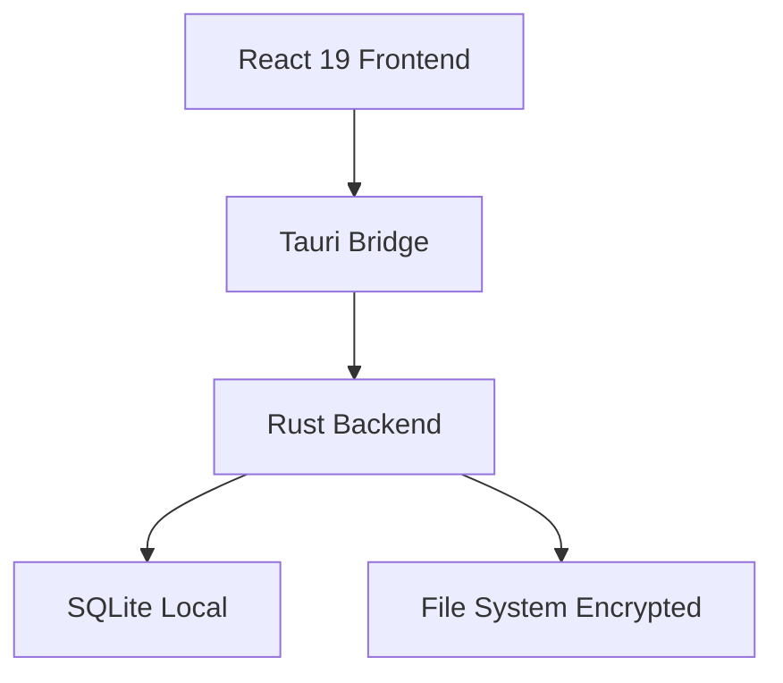

# 🧠 KEY FINDINGS - Invoice Zero

> _Decisiones arquitectónicas para un SaaS local-first centrado en privacidad._

Este documento detalla por qué construimos "al revés" de la industria SaaS tradicional (Local vs Cloud).

---

## Hallazgo #1: La Ventaja Local-First

**Descubrimiento**: Los usuarios financieros valoran la privacidad por encima de la sincronización en la nube para tareas críticas.

**Decisión**: Arquitectura **SQLite + Tauri**.

- Los datos viven en el dispositivo del usuario (`AppData`).
- Cero costos de servidor para nosotros (Margen infinito).
- Cumplimiento GDPR/CCPA automático (no procesamos datos).

📄 Fuente: [README.md](../README.md)

---

## Hallazgo #2: Tauri v2 vs Electron

**Problema**: Electron consume ~150MB de RAM en reposo. Inaceptable para una utilidad de segundo plano.

**Solución**: Migración a **Tauri v2 (Rust)**.

- Backend en Rust: Seguro por diseño (Memory Safe).
- Frontend en React 19: UI moderna.
- Peso del binario: &lt; 10MB vs ~100MB de Electron.

---

## Hallazgo #3: Modelo de Negocio "Buy Once"

**Hipótesis**: La fatiga de suscripción (SaaS Fatigue) es real.
**Estrategia**: Venta de licencia única (Lifetime) vs MRR.

- Alinea incentivos: No necesitamos retener datos para el "lock-in".
- El lock-in es la calidad del software, no la base de datos.

---

## 📚 Stack Tecnológico

_Última actualización: 2026-02-05_
